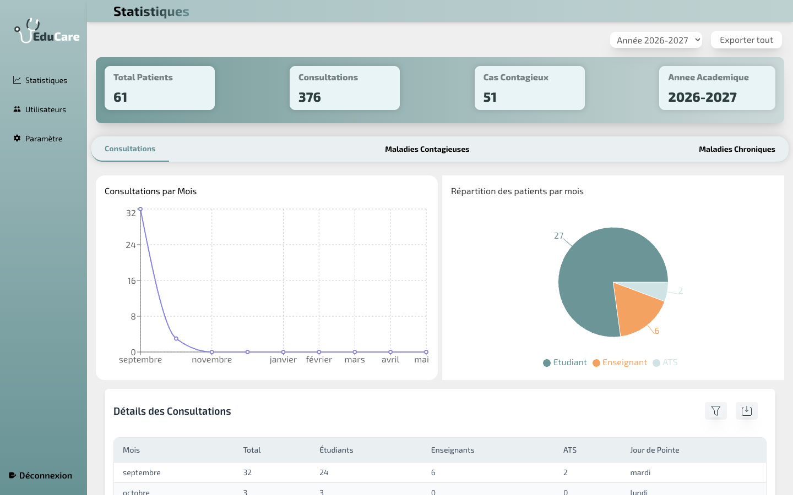
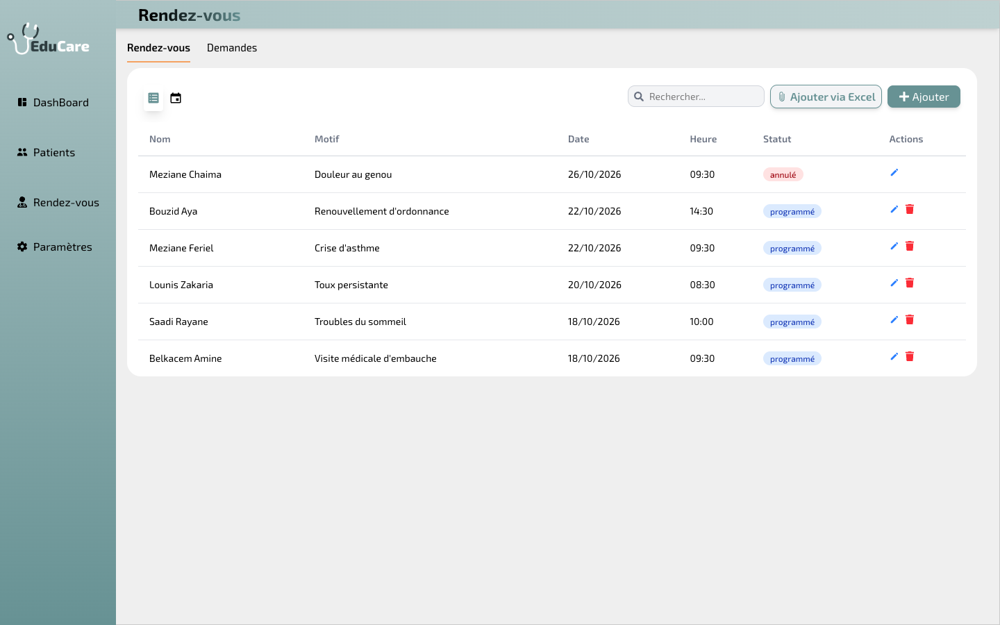
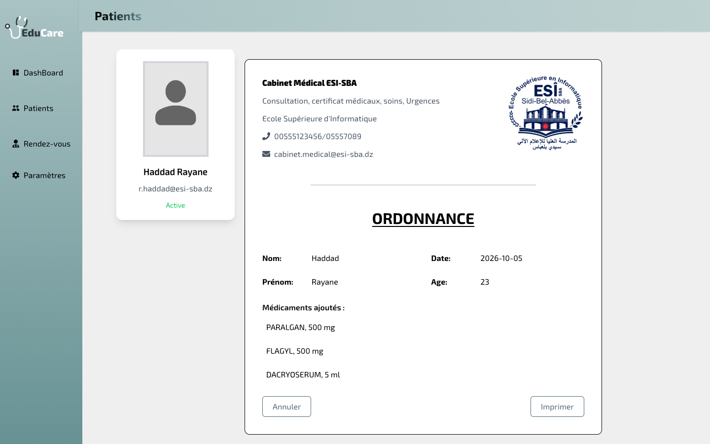
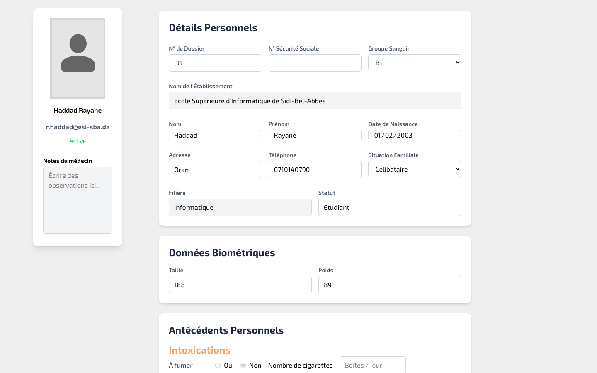

# EduCare

Web application for a school medical service (ESI Sidi Bel Abbès): doctors manage patient
records, consultations, physical exams, prescriptions and appointments; the director follows
statistics on consultations and diseases; the administrator manages accounts.



The frontend comes from a team project (React). This repository adds a new backend that runs
entirely locally (Express + SQLite) and is filled with demo data on first start, so the whole
application can be tried without any external service.

## Run it

Requirements: Node.js 22.13 or later (the database uses the built-in `node:sqlite`).

```bash
# 1. API on http://localhost:3000 (creates backend/data/educare.db with demo data)
cd backend
npm install
npm start

# 2. Web app on http://localhost:5173 (in a second terminal)
cd frontend
npm install
npm run dev
```

Open http://localhost:5173 and sign in with one of the demo accounts (password `educare123`):

| Role | Email | Lands on |
|---|---|---|
| Doctor | `medecin@esi-sba.dz` | patients, consultations, appointments |
| Director | `directeur@esi-sba.dz` | statistics dashboard |
| Administrator | `admin@esi-sba.dz` | users, doctors, archive |

All patients are fictional. `npm run seed` in `backend/` recreates the database from scratch.

## Features

- **Doctor**: patient list and search, medical record (personal details, biometrics,
  history, smoking and alcohol), consultations, physical exam, prescriptions with a medicine
  search and print view, appointment list and calendar, patient requests to schedule or
  refuse, bulk scheduling from an Excel file.
- **Director**: totals, consultations per month and per category, busiest weekday,
  contagious and chronic disease statistics by sex and peak month, PDF export.
- **Administrator**: create doctor, director and patient accounts (one by one or from
  Excel), enable/disable doctors, archive and restore users.
- **Patients** (API used by the mobile app): sign-up with email verification, password
  reset, appointment requests, access to their own record, consultations and prescriptions.

| Appointments | Prescription | Medical record |
|---|---|---|
|  |  |  |

## Backend

```
backend/
  src/
    app.js              Express app, routes, error handling
    config.js           settings (all optional, see .env.example)
    db/schema.sql       SQLite schema
    db/seed.js          demo data
    middleware/auth.js  JWT authentication, roles, ownership checks
    routes/             patients, medecins, admin, directeur, stats, notifications
    services/           accounts, Excel import, emails, appointment slots
  test/api.test.js      API tests (npm test)
```

- Every route checks the role of the caller; a patient can only read their own data.
- Passwords are hashed with bcrypt. Activation and password-reset links are signed tokens that
  cannot be used to call the API.
- Without SMTP settings, emails (activation and reset links) are printed in the API console.
- `npm test` runs the API tests against a temporary database.

## Frontend changes

- Backend URL in one place (`frontend/src/api.js`, `VITE_API_URL`), login token added to every
  API call.
- Fixed pages that crashed or showed wrong data: new medical record page, consultation form,
  doctors list, appointment cancel and add, admin dashboard route, import path that broke the
  build on Linux, academic year in the statistics.

## Tech stack

React 19, Vite, Tailwind CSS, Recharts, FullCalendar, jsPDF · Node.js, Express 5, SQLite
(`node:sqlite`), JSON Web Tokens, bcrypt, ExcelJS.
